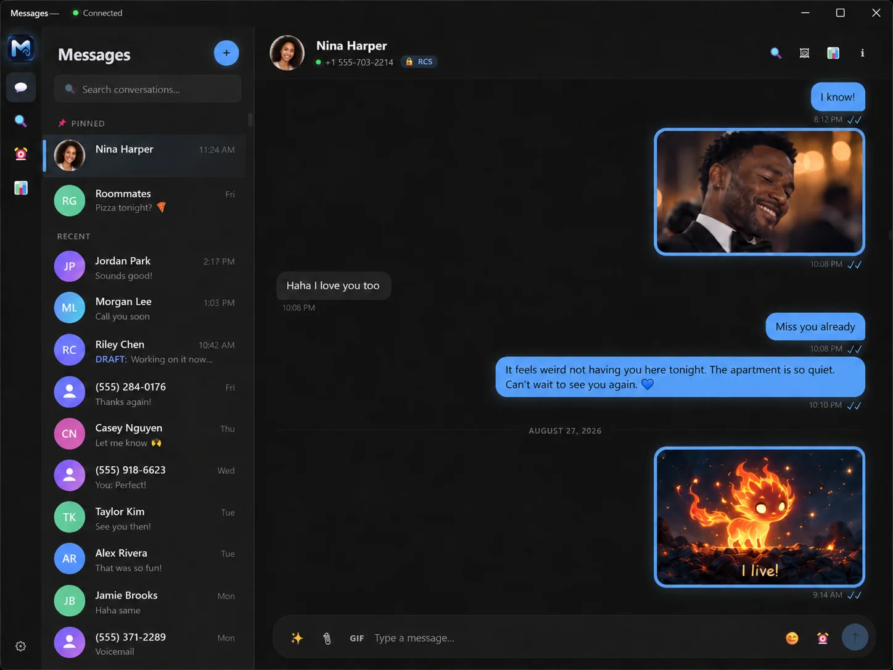

  

<h1 align="center">KrazeMessage</h1>

  <b>Send and read your phone's texts from your PC, with built-in AI that helps you write replies, translate, and catch up on long chats.</b>

  
  &nbsp;
  

  Works on Windows 10 and 11 (64-bit). You'll need an Android phone, and updates are signed.

  

* The messages and photos shown here are not real.

---

KrazeMessage connects to your Android phone and brings your full chat history to a clean Windows app.
Everything stays saved on your own computer.

## Features

### AI that works inside your chats

Every AI feature is off until you turn it on, and nothing is sent out until you ask. You choose which
AI to use: Claude, ChatGPT, or free local models with Ollama. Local models run completely offline, so
nothing ever leaves your PC.

- **Reply help.** It reads the recent chat and suggests a few replies in the tone you choose. You can edit any of them before you send.
- **Translate.** Turn a message you receive into your language, or write in English and send it in theirs.
- **Summarize.** Pull the main points, dates, and open questions out of a long group chat in just a few lines.
- **Find events.** When a text mentions a day and time, it offers to add the event to your calendar. You confirm it first.
- **Reminders.** A reminder to text someone you haven't reached in a while, plus a heads-up before a birthday.
- **AI connector (MCP).** This lets your own AI tools read your chats and help you reply. It stays off until you turn it on, requires a key, and only runs on your computer.

### A real texting app

It sends real text messages over RCS and SMS, right on Windows. It's a full app, not just a mirror of
your phone screen.

- Send texts with reactions and replies. You'll see read receipts and when someone is typing.
- Record, send, and play voice messages.
- Share photos and files, and search for GIFs without leaving the app.
- Forward messages, and archive, pin, or mute any chat.
- Write a text now and schedule it to send later. You can still edit or cancel it.
- Search your entire chat history quickly, and use keyboard shortcuts to move faster.

### See who needs a reply

- **Relationship Radar.** A simple view of who you haven't texted in a while, who is waiting on a reply, and which chats are most active. It runs on your computer, with no AI involved.

### Private by design

- There's no account and no server, so there is nowhere for us to read your texts.
- Your texts, photos, and drafts stay in a single file on your PC. You can back it up or delete it whenever you want.
- No ads and no tracking.
- Sign in with your Google account inside the app, or use a QR code instead.
- Updates are signed and checked before they install.

## Get started

1. Download it and run the installer.
2. Click **Sign in with Google**, then confirm on your phone.
3. Start texting from your PC.

Updates download and install on their own, and each one is signed and checked before it runs.

## Learn more

See every feature and more screenshots at **[messages.kraze.online](https://messages.kraze.online)**.

## Built on

KrazeMessage is a fork of these open-source projects and builds on top of them.

- **[openmessage](https://github.com/maxghenis/openmessage)** is the project KrazeMessage started from.
- **[mautrix-gmessages](https://github.com/mautrix/gmessages)** provides libgm, the code that talks to Google Messages.
- **[MaxGhenis/gmessages](https://github.com/MaxGhenis/gmessages)** is the version of mautrix-gmessages this build uses.

---

Downloads and updates for KrazeMessage. Everything else is on the website.

